# Purpose

The walk-through of how each questioned is tackled is presented below.

# Folder set-up

The code below creates the folder structure that guides the workflow of
the practical.

``` r
CHOSEN_LOCATION <- "/Users/liezljansenvanrensburg/Desktop/data science/25424971"
fmxdat::make_project(Mac = TRUE, Open = FALSE)

Texevier::create_template(directory = glue::glue("{CHOSEN_LOCATION}/"), template_name = "25424971Question1")
Texevier::create_template(directory = glue::glue("{CHOSEN_LOCATION}/"), template_name = "25424971Question2")
Texevier::create_template(directory = glue::glue("{CHOSEN_LOCATION}/"), template_name = "25424971Question3")
Texevier::create_template(directory = glue::glue("{CHOSEN_LOCATION}/"), template_name = "25424971Question4")
```

# Question 1: Coffee

This section explores the potential coffee distributors for a coffee
shop in Stellenbosch. The cost (in USD), the roaster company, the roast
strength, ratings, and reviews of the coffees are considered.
Ulitimately, A supplier, Kakalove Cafe, is recommended

The code below loads the packages and the data. “United States and
Floyd” will now fall under United States.

``` r
if(!require ( "pacman" , quietly = TRUE ) ) {
   install.packages("pacman")
   library(pacman)
   }

pacman::p_load(purrr, lubridate, tidymodels, ggridges, ggthemes, readxl, tidyverse, lubridate, zoo, pwt10,janitor, ggsci)

list.files('25424971Question1/code/', full.names = T, recursive = T) %>% as.list() %>% walk(~source(.))

coffee_data <- read.csv("25424971Question1/data/Coffee/Coffee.csv") %>% 
    clean_names() %>%
    mutate(
    loc_country = case_when(
      str_detect(loc_country, regex("united states", ignore_case = TRUE)) ~ "United States",
      TRUE ~ loc_country
    )
  ) %>%
  mutate(roast = na_if(roast, "")) %>%
  drop_na(roast)
```

## Average Rating and Price

### Average Rating and Price by Roaster Location

The plot below indicates that Australia and England are clear outliers.
Although roasters in these countries have, on average, the highest
ratings, all the countries receive an average rating of 90 or above. I
would suggest that the prices disqualify the further consideration of
Australian and English roasters.

``` r
g <-
    plot_rating_vs_price(data = coffee_data, group_var = loc_country, title = "Average Rating and Price by Roaster Country")
    
g
```


### Average Rating and Price by Roaster Location, excluding Outliers

Ratings cluster between 92 and 94, however, outliers in price remain.

``` r
coffee_filtered <- coffee_data %>% 
    filter(!loc_country %in% c("Australia", "England"))
g <- plot_rating_vs_price(data = coffee_filtered, group_var = loc_country, title = "Average Rating and Price by Location of Roaster without Outliers")
    
g
```


### Average Rating and Price by Roast Level

I now want to look at the relationship between roast, cost, and rating.
I see that some (15) observations dont have a roast category, so Ill go
back and remove blanks from the original dataframe (coffee_data). Cost
and Rating have no blanks or missing values.

I see that I can just go back and adapt my function so that I can
specify how I should group and then I can use the function to visualise
the relationship between roast, price, and country. I actually am
understanding the use of functions now!

Light roast has the highest average rating, but also the highest average
cost. Dark has the lowest average rating and the lowest cost.
Medium-light and medium roast offer a middle-ground.

``` r
coffee_filtered %>% distinct(roast)
```

    ##          roast
    ## 1 Medium-Light
    ## 2       Medium
    ## 3        Light
    ## 4  Medium-Dark
    ## 5         Dark

``` r
coffee_data %>%
  summarise(
    across(c(roast, cost_per_100g, rating), 
           list(n_na = ~sum(is.na(.)),
                n_blank = ~sum(. == "", na.rm = TRUE)))
  )
```

    ##   roast_n_na roast_n_blank cost_per_100g_n_na cost_per_100g_n_blank rating_n_na
    ## 1          0             0                  0                     0           0
    ##   rating_n_blank
    ## 1              0

``` r
k <-
    plot_rating_vs_price(data = coffee_filtered, group_var = roast, title = "Average Rating and Price by Roast Level")
    
k
```


## Indicator words

I now want to do something with the indicator words. I like sweet,
chocolate, and aroma (most used and not filler - like cup). I’ll use
pivot longer to create a “review” column that holds all three
description columns. From there I want to see which observations have
one or more of the chosen indicator words. I specify chocolate as
“chocolat” so that different forms of the word is included.

I first just filtered to the reviews that include the indicator words,
but I want to add a column to show which words are included so that I
can do some analysis on that potentially. This took some time to figure
out what looks right, but now I am happy with the wrangling function.
Now I have a matched_words column that shows which indicator words are
included in the review and only the observations that have any of these
words are kept.

Wrangle the data using a function:

``` r
coffee_indicators <- extract_indicator_words(data = coffee_filtered)

head(coffee_indicators, 10)
```

    ## # A tibble: 10 × 12
    ##    name         roaster roast loc_country origin_1 origin_2 cost_per_100g rating
    ##    <chr>        <chr>   <chr> <chr>       <chr>    <chr>            <dbl>  <int>
    ##  1 “Sweety” Es… A.R.C.  Medi… Hong Kong   Panama   Ethiopia         14.3      95
    ##  2 “Sweety” Es… A.R.C.  Medi… Hong Kong   Panama   Ethiopia         14.3      95
    ##  3 Flora Blend… A.R.C.  Medi… Hong Kong   Africa   Asia Pa…          9.05     94
    ##  4 Flora Blend… A.R.C.  Medi… Hong Kong   Africa   Asia Pa…          9.05     94
    ##  5 Ethiopia Sh… Revel … Medi… United Sta… Guji Zo… Souther…          4.7      92
    ##  6 Ethiopia Sh… Revel … Medi… United Sta… Guji Zo… Souther…          4.7      92
    ##  7 Ethiopia Su… Roast … Medi… United Sta… Guji Zo… Oromia …          4.19     92
    ##  8 Ethiopia Su… Roast … Medi… United Sta… Guji Zo… Oromia …          4.19     92
    ##  9 Ethiopia Su… Roast … Medi… United Sta… Guji Zo… Oromia …          4.19     92
    ## 10 Ethiopia Ge… Big Cr… Medi… United Sta… Gedeb D… Gedeo Z…          4.85     94
    ## # ℹ 4 more variables: review_date <chr>, review_number <chr>, review <chr>,
    ## #   matched_words <chr>

``` r
# wow, that actually worked
```

### Average Rating and Price by Review Indicator Words

This plot indicates that coffee brands that have reviews describing the
aroma and chocolatiness of the coffee are the best deal when it comes to
the ratings-price relationship. Subsequent analysis will be focused on
these observations.

``` r
g <-
    plot_rating_vs_price(data = coffee_indicators, group_var = matched_words, title = "Average Rating and Price by Review Indicator Words")
    
g
```


### Boxplot by Country and Roast Level

The goal is to trim the most expensive coffee products (this is informed
by the subsequent analysis). Boxplot shows the outliers in red. The
boxplot also illustrates that Taiwan and the US are the have the most
roasters.

``` r
d <- plot_cost_boxplot(data = coffee_indicators)
d
```


### Price Distribution

The distribution in price aids in determining where a hard cap on the
price should be. At USD8 per 100 grams, there is a fall in the number of
coffee products sold at this price, and provides a reasonable cap.

``` r
d <- plot_cost_distribution(data = coffee_indicators, cutoff = 8)
d
```


### Tile Plot to Visualise Average Ratings by Roaster and Roast level

I have 4 variables that I now want to visualise 4 variables: roaster,
roast, cost, and rating.The tile graph will have rating, roaster, and
roast. I start with a new function that filters to the observations that
have aroma and chocolate indicator words in their reviews. This then
gets passed to a ggplot to make a tile graph. I need to calculate a
midpoint for the graph, so I do that before the tile plot code. I see
that I have to pull the midpoint otherwise it is a dataframe and there
are issues later on. I then just do the tile plot code like I practised.
I’m sure I can improve the functionality to make it more generic, but
this will do for now.

There are still way too many roasters. I should go back and use price
distributions to decide on a cutoff price.

I have decided on USD8 as the cutoff price and now I can use the tile
graph. It is still very cramped, so I’m going to adjust the text
settings and see if that looks good. There are still too many roasters.
I am only going to look at roasters that have more than one roast level,
so that the supplier offers a diversified range of coffee. I will just
group and ungroup to filter this in the function code.

This plot depicts the average ratings by roaster and roast level once
the coffee products that have a cost larger than USD8 and roasters that
only supply one remaining product have been filtered out. The reasoning
is that a distributor can provide a diversified selection of products.

``` r
f <- plot_choc_aroma_tile(data = coffee_indicators)
f
```


### Prices and Ratings for Roasters

The plot below displays the price-ratings relationship for narrowd-down
roasters. Kakalove Cafe seems to be a promising supplier, with most of
its product prices falling the lowest, and receiving the highest some of
the highest ratings. They also produce a variety of products.

``` r
f <- plot_choc_aroma_scatter(data = coffee_indicators)
f
```


# Question 2: Baby Names

This report explores the persistence in baby name trends, as well as the
potential influence of popular culture on these trends using US name
data from 1910-2014.

``` r
# set up

if(!require ( "pacman" , quietly = TRUE ) ) {
   install.packages("pacman")
   library(pacman)
   }

pacman::p_load(purrr, lubridate, tidymodels, ggridges, ggthemes, readxl, tidyverse, lubridate, zoo, pwt10,janitor, ggsci, haven)

list.files('25424971Question2/code/', full.names = T, recursive = T) %>% as.list() %>% walk(~source(.))


# load data
baby_names <- read_rds("25424971Question2/data/US_Baby_names/Baby_Names_By_US_State.rds") %>% 
    clean_names
top_100 <- read_rds("25424971Question2/data/US_Baby_names/charts.rds") %>% 
    clean_names
hbo_titles <- read_rds("25424971Question2/data/US_Baby_names/HBO_titles.rds") %>% 
    clean_names
hbo_credits <- read_rds("25424971Question2/data/US_Baby_names/HBO_credits.rds") %>% 
    clean_names
```

### Spearman Rank Correlation

I like the idea of state-level data (especially New York), but for this
process, I will aggregate to a national level through the national
ranked function. I will get the top 25 most popular for girls and boys.
I will look at t, t+1, t+2, and t+3.

After I aggregate, I use the rank function, but this has assigned the
largest rank to the most popular name (need the opposite). To get to the
top 25, I just filter rank to be smaller or equal to 25 (shamefully,
took me a while to figure out).

To compute the Spearman correlation, I define base year and future year
objects in the function and then combine them to calculate the
correlation between the rankings of these years using the Spearman
method. The spearman results function expands over all the years (until
2011, as 3 future periods from then is 2014) and 1 to 3 lags are chosen,
as specified in the instructions. The variable correlation is now all
the spearman correlations across the years, genders, and lag lengths.
For the plot, new variables are created that are used as labels. Have to
make the lag variable a factor in order to apply my favourite palette. I
use the facet wrap so that I can view what is happening to girls’ and
boys’ names separately.

``` r
national_ranked <- get_national_ranked(baby_names)
top_25_names           <- get_top_25_names(national_ranked)
spearman_results <- get_spearman_results(top_25_names, national_ranked)
```

The time-series representations below depict the rank correlations of
baby names in the US from 1910-2014. It seems that boy names are more
persistent than girls names. It does appear that after the 1990’s, names
become less persistent, with the correlations becoming smaller. The
persistence in name trends has fallen for both girl and boy names over
time, however, trends seem to persistent longer still for boy names.

``` r
g <- plot_spearman_trends(spearman_results)
g
```


### Surges in Names

I want to make a function that spits out the names that have surged in
popularity over the course of a year. I create the variables to
calculate the year-on-year change in the number of children with each
name. I need to determine what percentage would classify as a surge.
After toggling it, I have chosen a threshold of 5000% for reporting. I
choose to look into “Mallory”. The function to create the graph is
simple, but I want to spruce it up a bit. I add a line to show when
“Family Ties” premiered.

Only 24% of the names have experienced a year-on-year surge greater than
5000% between 1910-2014 are boy names. The plot below inspects the
popularity of the name “Mallory” over time. “Mallory” spiked in 1983
following the 1982 premiere of “Family Ties” that included the
character, Mallory Keaton. It’s popularity dulled over the years,
illustrating the influence of popular culture on baby names.

``` r
name_surges <- get_surges(national_ranked)
```

``` r
b <- plot_name_trend(national_ranked, "Mallory")
b
```


### Name Influences: Jude

Inspired by the Beatles documentary, “Get Back”, I want to look into
“Jude”. It looks like it gained more popularity in the 2000s. When I
think of the name, I think of Jude Law. I’ll see if he is credited and
when his breakout roles were (The Talented Mr Ripley was released in
1999).

According to the Billbord Hot 100, The Beatles’s hit song, “Hey Jude”,
was charting for 19 weeks between 1968 and 1969. Further, the credits
for popular films reveal that Jude Law stardom may also drive interest
in this gender neutral name. These two case studies depict the impact of
the media in naming conventions

``` r
b <- plot_name_jude(national_ranked, "Jude")
b
```


## Conclusion

Baby name trends are increasingly less persistent. This means that toy
names must quickly adapt, especially those marketed towards girls. To
stay on top of the trends, popular media must be studied. Through
analysing song charts and IMDb ratings, the company can stay inline with
the curve.

# Question 3: Loans and Credit

The key drivers of default risk are explored. The following factors of
individuals are considered: whether the income source was verified, the
debt-to-income ratio, the number of year that the individual has had any
sort of credit line, prior bankruptcies, the number of mortgage
accounts, bankcard utilisation, interest rate, term length, and history
of credit behaviour.

I create a function to clean the data. Irrelevant columns are dropped (I
could have been more liberal with this), the term variable is mutated
into a number, and employment length into an ordered factor (later on
other variables are mutated in plot functions). There are 7 categories
under the loan status. I am trying to think of how to divide them. I am
unsure of how to categorise them, so I make a few variables. I create a
binary variable (concluded_loan), where 1 is loss and default, and 0 is
fully paid. (I had to do some digging to understand that “default” means
that there is still hope of some recovery and “charged off” means that a
loss is official). I believe that default should be included for
completedness. I make broader variable (loan_outcome) that has 5
categories (fully paid, charged off, current, partial default, and
default).

For analysis, I will look at concluded loans only (either fully paid or
loss/default). I make a function to pull only this data and create an
object for resolved loans.

``` r
if(!require ( "pacman" , quietly = TRUE ) ) {
   install.packages("pacman")
   library(pacman)
}

if(!require ( "stargazer" , quietly = TRUE ) ) {
   install.packages("stargazer")
   library(stargazer)
   }
```

    ## 
    ## Please cite as:

    ##  Hlavac, Marek (2022). stargazer: Well-Formatted Regression and Summary Statistics Tables.

    ##  R package version 5.2.3. https://CRAN.R-project.org/package=stargazer

``` r
pacman::p_load(purrr, lubridate, tidymodels, ggridges, ggthemes, readxl, tidyverse, lubridate, zoo, pwt10,janitor, ggsci, haven, knitr)

list.files('25424971Question3/code/', full.names = T, recursive = T) %>% as.list() %>% walk(~source(.))

# load data
loan_credit <- read_rds("25424971Question3/data/Loan_Cred/loan_data.rds")

# New category variables are created and the dataframe is simplified.
loan_clean <- get_clean_loans(loan_credit)
loan_resolved <- make_loan_resolved(loan_clean)
```

## Inspecting the Hypothesised Key Drivers

Summary statistics on the key variables reveal the need for tweaks in
the data cleaning. The Debt-to-Income ratio has a maximum value of 999,
which indicates the presence of outliers. It also has a negative minimum
value, which feels incorrect. Utilisation also has outliers. The
cleaning function is adapted to filter to trim and correct these and to
declare verification status variable as a factor and the earliest credit
line variable is mutated to an age. This yields satisfactory summary
statistics

``` r
loan_resolved %>% 
    select(verification_status, dti, credit_age_yrs, 
           pub_rec_bankruptcies, pct_tl_nvr_dlq, 
           mort_acc, bc_util, num_rev_accts) %>% 
    summary()
```

    ##       verification_status      dti        credit_age_yrs  pub_rec_bankruptcies
    ##  Not Verified   :109014   Min.   : 0.00   Min.   :11.00   Min.   :0.0000      
    ##  Source Verified:156317   1st Qu.:11.97   1st Qu.:21.00   1st Qu.:0.0000      
    ##  Verified       :107354   Median :17.98   Median :25.00   Median :0.0000      
    ##                           Mean   :18.55   Mean   :26.32   Mean   :0.1535      
    ##                           3rd Qu.:24.73   3rd Qu.:30.00   3rd Qu.:0.0000      
    ##                           Max.   :48.68   Max.   :81.00   Max.   :8.0000      
    ##                                                                               
    ##  pct_tl_nvr_dlq      mort_acc         bc_util       num_rev_accts   
    ##  Min.   :  0.00   Min.   : 0.000   Min.   :  0.00   Min.   :  2.00  
    ##  1st Qu.: 90.90   1st Qu.: 0.000   1st Qu.: 32.70   1st Qu.:  8.00  
    ##  Median : 97.60   Median : 1.000   Median : 57.00   Median : 13.00  
    ##  Mean   : 93.96   Mean   : 1.592   Mean   : 55.47   Mean   : 14.38  
    ##  3rd Qu.:100.00   3rd Qu.: 3.000   3rd Qu.: 80.70   3rd Qu.: 19.00  
    ##  Max.   :100.00   Max.   :37.000   Max.   :100.30   Max.   :105.00  
    ##  NA's   :1

## Logistic Regression Models

Concluded loans is my dependent variable. Since it is binary, I will use
a logit. The second regression adds the credit grade, interest rate, and
term length as regressors.

``` r
logit_model_1 <- glm(concluded_loan ~ verification_status + dti + credit_age_yrs +
                       pub_rec_bankruptcies + pct_tl_nvr_dlq + 
                       mort_acc + bc_util + num_rev_accts,
                   data   = loan_resolved,
                   family = binomial(link = "logit"))


logit_model_2 <- glm(concluded_loan ~ verification_status + dti + credit_age_yrs +
                         pub_rec_bankruptcies + pct_tl_nvr_dlq + 
                         mort_acc + bc_util + num_rev_accts +
                         grade + int_rate + term,
                     data   = loan_resolved,
                     family = binomial(link = "logit"))
```

### Results from Logistic Regressions

Across both specifications, all the coefficients are statistically
significant, justifying their statuses as key drivers of default risk.
The Lending Club’s credit grade system proves to be great indicator of
debt default, with lower grades being associated with an increased
probability of default. The DTI ratio, prior bankruptcies, and bankcard
utilisation are also associated with increased default risk. The number
of mortgage accounts and never having missed payments on debt are
associated with a lower default rate. Although the positive relationship
between verification status and default risk may seem counterintuitive,
it indicates selection bias, where a background check is run on
individuals who are in a worse financial position.

``` r
stargazer(logit_model_1, logit_model_2,
          type        = "text",           # use "html" if outputting to HTML Rmd
          title       = "Logistic Regression: Predictors of Loan Default",
          dep.var.labels = "Default (1 = Loss, 0 = Paid)",
          covariate.labels = c("Source Verified", "Verified",
                               "DTI", "Credit Age",
                               "Prior Bankruptcies", "% Never Delinquent",
                               "Mortgage Accounts", "Bankcard Utilisation",
                               "No. Revolving Accounts",
                               "Grade B", "Grade C", "Grade D",
                               "Grade E", "Grade F", "Grade G",
                               "Interest Rate", "Term"),
          #apply.coef  = exp,              # shows odds ratios instead of log-odds
          p.auto      = TRUE,
          star.cutoffs = c(0.05, 0.01, 0.001),
          no.space    = TRUE)
```

    ## 
    ## Logistic Regression: Predictors of Loan Default
    ## =====================================================
    ##                             Dependent variable:      
    ##                        ------------------------------
    ##                         Default (1 = Loss, 0 = Paid) 
    ##                              (1)            (2)      
    ## -----------------------------------------------------
    ## Source Verified           0.346***        0.188***   
    ##                            (0.010)        (0.011)    
    ## Verified                  0.555***        0.283***   
    ##                            (0.011)        (0.012)    
    ## DTI                       0.027***        0.015***   
    ##                           (0.0005)        (0.0005)   
    ## Credit Age                -0.006***       0.004***   
    ##                            (0.001)        (0.001)    
    ## Prior Bankruptcies        0.179***        0.079***   
    ##                            (0.009)        (0.010)    
    ## % Never Delinquent        -0.007***      -0.004***   
    ##                           (0.0004)        (0.0005)   
    ## Mortgage Accounts         -0.126***      -0.123***   
    ##                            (0.003)        (0.003)    
    ## Bankcard Utilisation      0.005***        0.002***   
    ##                           (0.0001)        (0.0002)   
    ## No. Revolving Accounts    0.005***        0.005***   
    ##                            (0.001)        (0.001)    
    ## Grade B                                   0.655***   
    ##                                           (0.020)    
    ## Grade C                                   1.044***   
    ##                                           (0.026)    
    ## Grade D                                   1.290***   
    ##                                           (0.037)    
    ## Grade E                                   1.413***   
    ##                                           (0.048)    
    ## Grade F                                   1.590***   
    ##                                           (0.060)    
    ## Grade G                                   1.678***   
    ##                                           (0.078)    
    ## Interest Rate                             0.028***   
    ##                                           (0.003)    
    ## Term                                      0.016***   
    ##                                           (0.0004)   
    ## Constant                  -1.409***      -3.419***   
    ##                            (0.047)        (0.056)    
    ## -----------------------------------------------------
    ## Observations               372,684        372,684    
    ## Log Likelihood          -191,565.700    -180,892.700 
    ## Akaike Inf. Crit.        383,151.300    361,821.500  
    ## =====================================================
    ## Note:                   *p<0.05; **p<0.01; ***p<0.001

## Default-Risk Customer Profiles

This section explores the various characteristics of indivuduals and how
these may indicate their propensity to default on their debt. I start by
analysing credit grades, as that was deemed a key risk driver in the
regressions. If I take the average of the binary dependent by credit
grade, that will indicate the “default rate” for each grade. Here,
defaulting is charged off and defaulted loans (1). I am going to create
a function so that I can view default rates across categorical
variables. Viewing default rates across states requires its own function
so that I can make some tweaks in the layout.

### Default Rate by Lending Club’s Grading System

The plot below illustrates that default rates increase as credit grades
worsen. Customers that are assigned poor Lending Club credit grades are
at higher risk of defaulting on their debt.

``` r
d <- plot_default_by_group(loan_resolved, grade,
                      title   = "Default Rate by Credit Grade",
                      x_label = "Credit Grade")
d
```

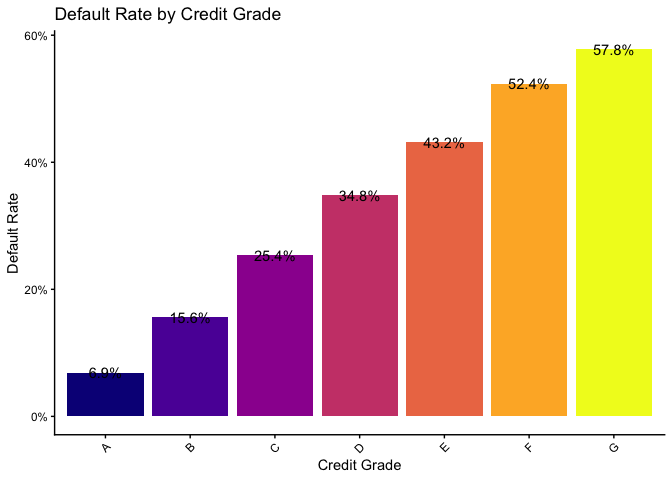

### Default Rate by Home Ownership

Individuals that rent instead of own their house/mortgage have an
average default rate of 26.9%. Owning a mortgage is associated with the
lowest average default rate, supporting the findings of the logit
regression, where the number of mortgages negatively relates to the
default rate. This may simply be a proxy for income.

``` r
d <- plot_default_by_group(loan_resolved, home_ownership,
                      title   = "Default Rate by Home Ownership",
                      x_label = "Home Ownership"
                      )
d
```

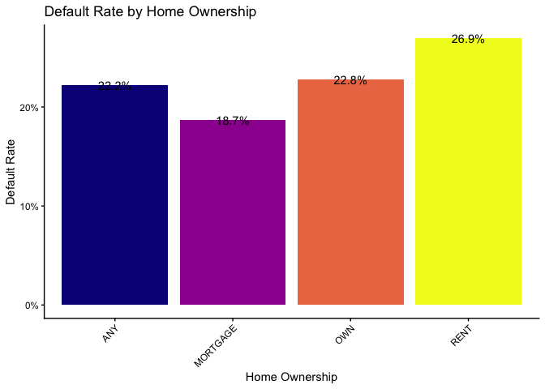

### Default Rate by Employment Length

The default rate appers to be similarly distributed across employment
lengths, with a slight downward trend, such that longer employment years
(stable income) indicate a slightly lower risk of default.

``` r
c <- plot_default_by_group(loan_resolved, emp_length,
                      title   = "Default Rate by Employment Length",
                      x_label = "Employment Length")
                      
c
```

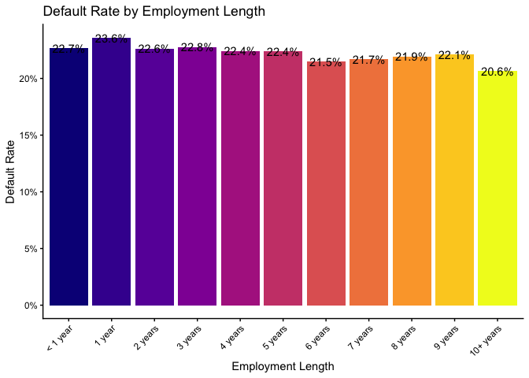

### Default Rate by State for Both Long and Short Term Loans

Arkansas, Los Angeles, Mississipi, Nebraska, and Oklahoma have the
highest average default rates, signalling that individuals from these
states iintroduce increased risk. Whereas individuals from DC, Maine,
New Hampshire, Oregan, Vermont, and West Virginia signal prudence, as
these states have the lowest average default rates.

``` r
c <-  plot_default_by_state(loan_resolved)
                      
c
```

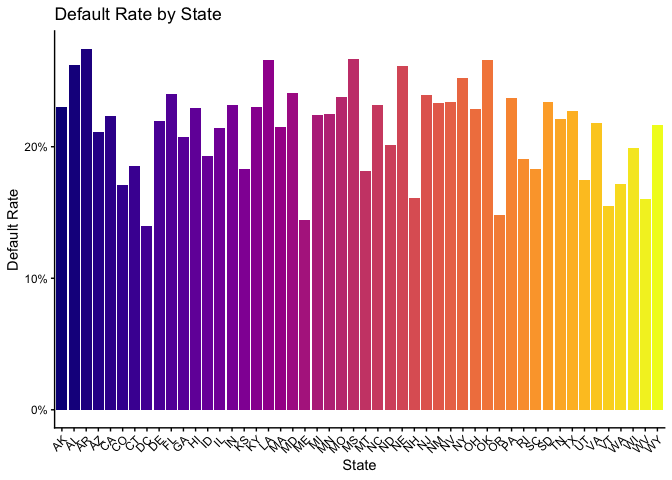

### Default Rate by State for Short Term Loans Only

The state analysis is similar when only short-term loans are considered.

``` r
c <-  ST_plot_default_by_state(loan_resolved)
                      
c
```

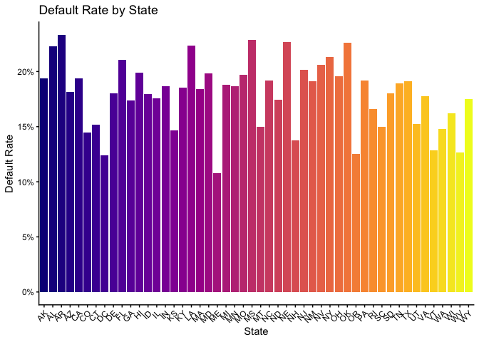

### Default Rate by Purpose of Loan

Individuals who cite funding a small business or planning a wedding as
the reason for their debt obligations are at the highest risk of
defaulting on their loans.

``` r
c <- plot_default_by_group(loan_resolved, purpose,
                      title   = "Default Rate by Purpose of Debt",
                      x_label = "Purpose")
                      
c
```

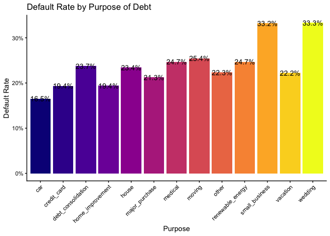

## The Debt-to-Income and Loan Status Relationship

The average debt-to-income ratio is the highest for those who have
defaulted on their loans and completely written their loans off,
although the variance is not large across these broader loan status
groups.

``` r
c <-  plot_dti_by_outcome(loan_clean)
                      
c
```

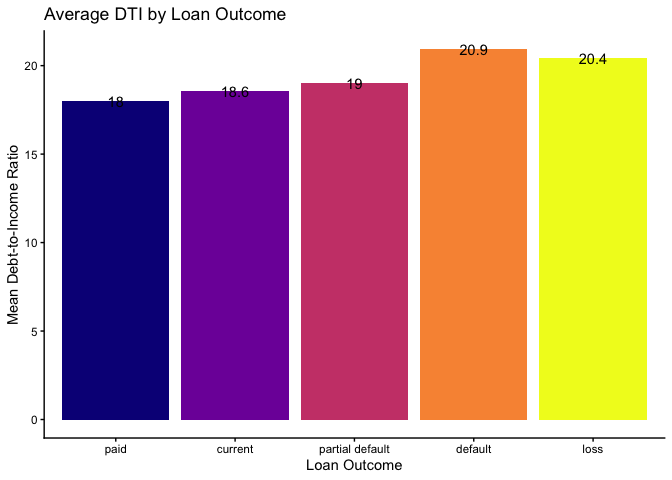

## Conclusion

Multiple factors must be considered when approving loan applications to
ensure that the default rate is minimised. By scrutinizing over where
individuals reside, the debt-to-income ratios, the purpose of the
credit, the credit category, home ownership, length of employment, debt
history, and bankcard utilisation, debt default risk can be improved.

# Question 4: Netflix

The genre, ratings, country of production, and film length are factors
that determine which movies should be hosted on an up-and-coming
streaming site.

I’m starting by just creating a movie dataset from Imdb and mutating its
genre and production country variables to be useful. I simply use the
first-listed country as the primary production country. I need to do
something about the genres column with multiple genres. I’ll have one
dataset where just the primary genre (first listed) is included and then
I’ll make one separating each genre and pivoting longer.

``` r
if(!require ( "pacman" , quietly = TRUE ) ) {
   install.packages("pacman")
   library(pacman)
   }

pacman::p_load(purrr, lubridate, tidymodels, ggridges, ggthemes, readxl, tidyverse, lubridate, zoo, pwt10,janitor, ggsci, haven)

list.files('25424971Question4/code/', full.names = T, recursive = T) %>% as.list() %>% walk(~source(.))

# data load
titles <- read_rds("25424971Question4/data/netflix/titles.rds")
credits <- read_rds("25424971Question4/data/netflix/credits.rds")
movie_info <- read_csv("25424971Question4/data/netflix/netflix_movies.csv")
```

    ## Rows: 6131 Columns: 12
    ## ── Column specification ────────────────────────────────────────────────────────
    ## Delimiter: ","
    ## chr (11): show_id, type, title, director, cast, country, date_added, rating,...
    ## dbl  (1): release_year
    ## 
    ## ℹ Use `spec()` to retrieve the full column specification for this data.
    ## ℹ Specify the column types or set `show_col_types = FALSE` to quiet this message.

## IMDb Scores by Genre

For the density ridges by genre, the colour palette has to be extended.
I can adapt the function so that I can also look at the user scores
(tmdb) per genre. There is a blank genre, so I’m editing the
make_movies_longer function to filter out blank observations.

IMDb score density plots reveal that critics ratings are the highest
amongst documentaries, historical, and war films, motivating the
prioritisation of these genres for the streaming site. Horror films have
the flattest distribution, indicating that care should be taken when
selecting films from these genres.

``` r
titles %>% count(type)
```

    ## # A tibble: 2 × 2
    ##   type      n
    ##   <chr> <int>
    ## 1 MOVIE  3759
    ## 2 SHOW   2047

``` r
titles %>% 
  select(genres, production_countries) %>% 
  head(10)
```

    ## # A tibble: 10 × 2
    ##    genres                                  production_countries
    ##    <chr>                                   <chr>               
    ##  1 ['documentation']                       ['US']              
    ##  2 ['crime', 'drama']                      ['US']              
    ##  3 ['comedy', 'fantasy']                   ['GB']              
    ##  4 ['comedy']                              ['GB']              
    ##  5 ['horror']                              ['US']              
    ##  6 ['comedy', 'european']                  ['GB']              
    ##  7 ['thriller', 'crime', 'action']         ['US']              
    ##  8 ['drama', 'music', 'romance', 'family'] ['US']              
    ##  9 ['romance', 'drama']                    ['US']              
    ## 10 ['drama', 'crime', 'action']            ['US']

``` r
titles %>% 
  summarise(
    na_score    = sum(is.na(imdb_score)),
    na_runtime  = sum(is.na(runtime)),
    na_genres   = sum(is.na(genres)),
    na_country  = sum(is.na(production_countries)),
    na_year     = sum(is.na(release_year))
  )
```

    ## # A tibble: 1 × 5
    ##   na_score na_runtime na_genres na_country na_year
    ##      <int>      <int>     <int>      <int>   <int>
    ## 1      523          0         0          0       0

``` r
movies <- clean_movies(titles)
movies_long <- make_movies_long(movies)
```

``` r
w <- plot_genre_ridges(movies_long, 
                  score_var = imdb_score, 
                  title     = "IMDb Scores by Genre", 
                  x_axis    = "IMDb Score")
w
```

    ## Picking joint bandwidth of 0.297

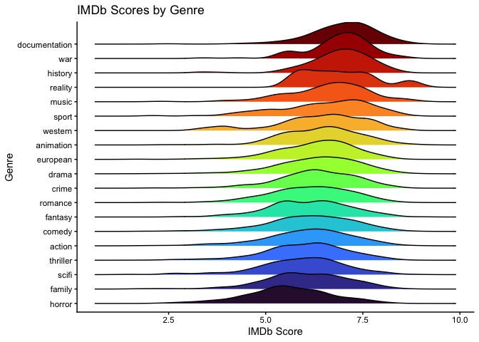

## User Scores by Genre

The reality genre of films might have the highest median user rating,
but the distribution is trimodal, indictaing that films should be
carefully selected. Further, music, hictoric, and documentary films are
highly rated amongst users. Since users will be the predominant viewers
on the streaming site, more credence should be given to their
preferences

``` r
w <- plot_genre_ridges(movies_long, 
                  score_var = tmdb_score, 
                  title     = "User Scores by Genre", 
                  x_axis    = "TMDB Score")
w
```

    ## Picking joint bandwidth of 0.269

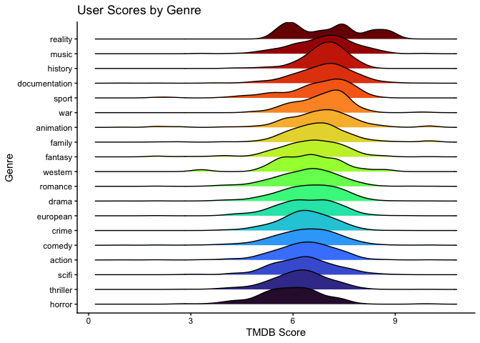

## Popularity, Ratings, and Runtime

A negative relationship exists between IMDb ratings and popularity
scores. This illustrates how controversy drums attention - which should
be kept in mind when curating a film catalog. Runtime is illustrated by
the size of the bubbles. War films have a long duration and high
popularity scoresa and ratings - the ideal genre.

``` r
m <- plot_score_scatter(movies,
                   x_var     = imdb_score,
                   y_var     = tmdb_popularity,
                   size_var  = runtime,
                   label_var = primary_genre,
                   title     = "IMDb Score vs TMDB Popularity by Genre",
                   x_axis    = "Avg IMDb Score",
                   y_axis    = "Avg TMDB Popularity")
m
```

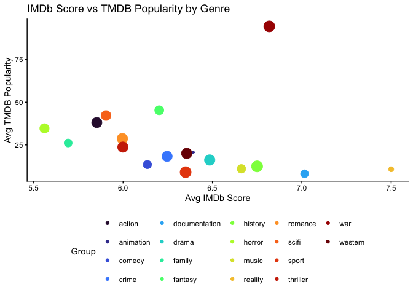

## Tile Plot of Average Rating by Country and Genre

There are too many countries, so I use the 15 countries that produce the
most movies.

Films primarily produced in the Phillipines in the crime, drama, science
fiction and European genres have the highest average ratings. These
films should be prioritised. Romance films produced in Turkey also
receive high praise. Films produced in Nigeria should be avoided and
Mexican films should be carefully selected to fall within the comedy and
crime genres.

``` r
m <- plot_country_genre_heatmap(movies_long)
```

    ## Scale for fill is already present.
    ## Adding another scale for fill, which will replace the existing scale.

``` r
m
```

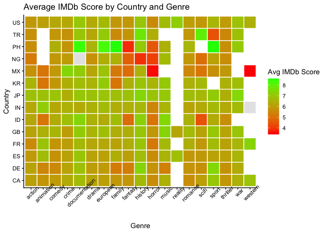

# Conclusion

Across the board, war fims and documentaries should be prioritised,
while popular - potentially controversial - films should be promoted to
stimulate interest in the streaming site. The country of production
should be considered when curating the films, as this potentially serves
as a proxy for quality and impacts ratings.
