# Purpose

The walk-through of how each questioned is tackled is presented below.

# Folder set-up

The code below creates the folder structure that guides the workflow of
the practical.

``` r
CHOSEN_LOCATION <- "/Users/liezljansenvanrensburg/Desktop/data science/25424971"
fmxdat::make_project(Mac = TRUE, Open = FALSE)

Texevier::create_template(directory = glue::glue("{CHOSEN_LOCATION}/"), template_name = "25424971Question1")
Texevier::create_template(directory = glue::glue("{CHOSEN_LOCATION}/"), template_name = "25424971Question2")
Texevier::create_template(directory = glue::glue("{CHOSEN_LOCATION}/"), template_name = "25424971Question3")
Texevier::create_template(directory = glue::glue("{CHOSEN_LOCATION}/"), template_name = "25424971Question4")
```

# Question 1: Coffee

This sections explores the potential coffee distributors for a coffee
shop in Stellenbosch. The cost (in USD), the roaster company, the roast
strength, ratings, and reviews of the coffees are considered.
Ulitimately, A supplier, Kakalove Cafe, is recommended

The code below loads the packages and the data. “United States and
Floyd” will now fall under United States.

``` r
if(!require ( "pacman" , quietly = TRUE ) ) {
   install.packages("pacman")
   library(pacman)
   }

pacman::p_load(purrr, lubridate, tidymodels, ggridges, ggthemes, readxl, tidyverse, lubridate, zoo, pwt10,janitor, ggsci)

list.files('25424971Question1/code/', full.names = T, recursive = T) %>% as.list() %>% walk(~source(.))

coffee_data <- read.csv("25424971Question1/data/Coffee/Coffee.csv") %>% 
    clean_names() %>%
    mutate(
    loc_country = case_when(
      str_detect(loc_country, regex("united states", ignore_case = TRUE)) ~ "United States",
      TRUE ~ loc_country
    )
  ) %>%
  mutate(roast = na_if(roast, "")) %>%
  drop_na(roast)
```

## Average Rating and Price

### Average Rating and Price by Roaster Location

The plot below indicates that Australia and England are clear outliers.
Although roasters in these countries have, on average, the highest
ratings, all the countries receive an average rating of 90 or above. I
would suggest that the prices disqualify the further consideration of
Australian and English roasters.

``` r
g <-
    plot_rating_vs_price(data = coffee_data, group_var = loc_country, title = "Average Rating and Price by Roaster Country")
    
g
```

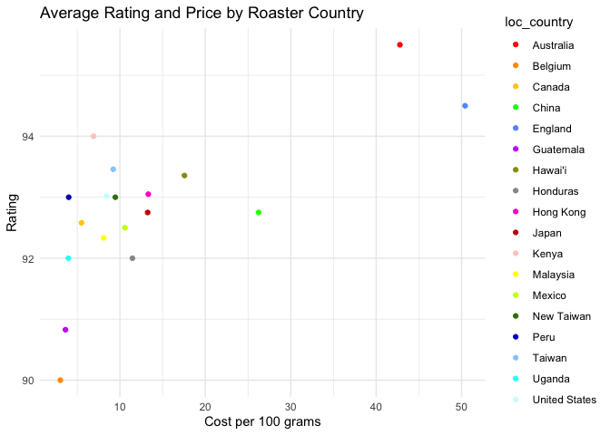

### Average Rating and Price by Roaster Location, excluding Outliers

Ratings cluster between 92 and 94, however, outliers in price remain.

``` r
coffee_filtered <- coffee_data %>% 
    filter(!loc_country %in% c("Australia", "England"))
g <- plot_rating_vs_price(data = coffee_filtered, group_var = loc_country, title = "Average Rating and Price by Location of Roaster without Outliers")
    
g
```

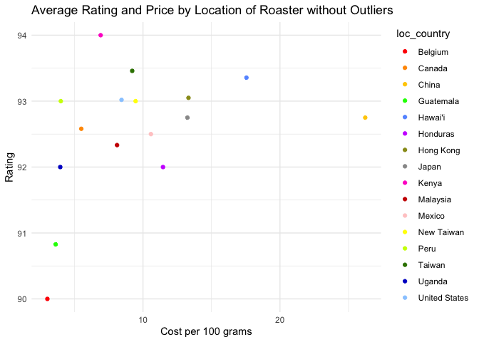

### Average Rating and Price by Roast Level

I now want to look at the relationship between roast, cost, and rating.
I see that some (15) observations dont have a roast category, so Ill go
back and remove blanks from the original dataframe (coffee_data). Cost
and Rating have no blanks or missing values.

I see that I can just go back and adapt my function so that I can
specify how I should group and then I can use the function to visualise
the relationship between roast, price, and country. I actually am
understanding the use of functions now!

Light roast has the highest average rating, but also the highest average
cost. Dark has the lowest average rating and the lowest cost.
Medium-light and medium roast offer a middle-ground.

``` r
coffee_filtered %>% distinct(roast)
```

    ##          roast
    ## 1 Medium-Light
    ## 2       Medium
    ## 3        Light
    ## 4  Medium-Dark
    ## 5         Dark

``` r
coffee_data %>%
  summarise(
    across(c(roast, cost_per_100g, rating), 
           list(n_na = ~sum(is.na(.)),
                n_blank = ~sum(. == "", na.rm = TRUE)))
  )
```

    ##   roast_n_na roast_n_blank cost_per_100g_n_na cost_per_100g_n_blank rating_n_na
    ## 1          0             0                  0                     0           0
    ##   rating_n_blank
    ## 1              0

``` r
k <-
    plot_rating_vs_price(data = coffee_filtered, group_var = roast, title = "Average Rating and Price by Roast Level")
    
k
```

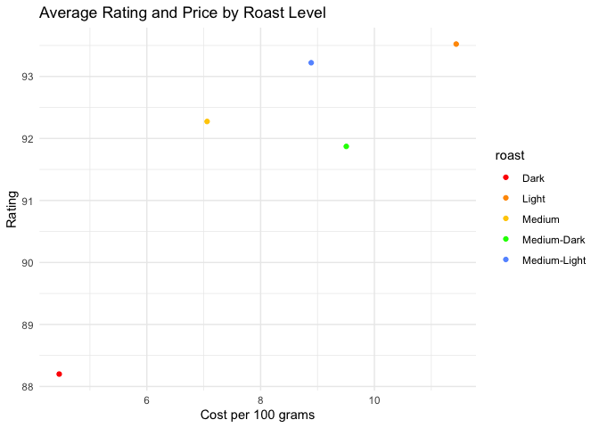

## Indicator words

I now want to do something with the indicator words. I like sweet,
chocolate, and aroma (most used and not filler - like cup). I’ll use
pivot longer to create a “review” column that holds all three
description columns. From there I want to see which observations have
one or more of the chosen indicator words. I specify chocolate as
“chocolat” so that different forms of the word is included.

I first just filtered to the reviews that include the indicator words,
but I want to add a column to show which words are included so that I
can do some analysis on that potentially. This took some time to figure
out what looks right, but now I am happy with the wrangling function.
Now I have a matched_words column that shows which indicator words are
included in the review and only the observations that have any of these
words are kept.

Wrangle the data using a function:

``` r
coffee_indicators <- extract_indicator_words(data = coffee_filtered)

head(coffee_indicators, 10)
```

    ## # A tibble: 10 × 12
    ##    name         roaster roast loc_country origin_1 origin_2 cost_per_100g rating
    ##    <chr>        <chr>   <chr> <chr>       <chr>    <chr>            <dbl>  <int>
    ##  1 “Sweety” Es… A.R.C.  Medi… Hong Kong   Panama   Ethiopia         14.3      95
    ##  2 “Sweety” Es… A.R.C.  Medi… Hong Kong   Panama   Ethiopia         14.3      95
    ##  3 Flora Blend… A.R.C.  Medi… Hong Kong   Africa   Asia Pa…          9.05     94
    ##  4 Flora Blend… A.R.C.  Medi… Hong Kong   Africa   Asia Pa…          9.05     94
    ##  5 Ethiopia Sh… Revel … Medi… United Sta… Guji Zo… Souther…          4.7      92
    ##  6 Ethiopia Sh… Revel … Medi… United Sta… Guji Zo… Souther…          4.7      92
    ##  7 Ethiopia Su… Roast … Medi… United Sta… Guji Zo… Oromia …          4.19     92
    ##  8 Ethiopia Su… Roast … Medi… United Sta… Guji Zo… Oromia …          4.19     92
    ##  9 Ethiopia Su… Roast … Medi… United Sta… Guji Zo… Oromia …          4.19     92
    ## 10 Ethiopia Ge… Big Cr… Medi… United Sta… Gedeb D… Gedeo Z…          4.85     94
    ## # ℹ 4 more variables: review_date <chr>, review_number <chr>, review <chr>,
    ## #   matched_words <chr>

``` r
# wow, that actually worked
```

### Average Rating and Price by Review Indicator Words

This plot indicates that coffee brands that have reviews describing the
aroma and chocolatiness of the coffee are the best deal when it comes to
the ratings-price relationship. Subsequent analysis will be focused on
these observations.

``` r
g <-
    plot_rating_vs_price(data = coffee_indicators, group_var = matched_words, title = "Average Rating and Price by Review Indicator Words")
    
g
```

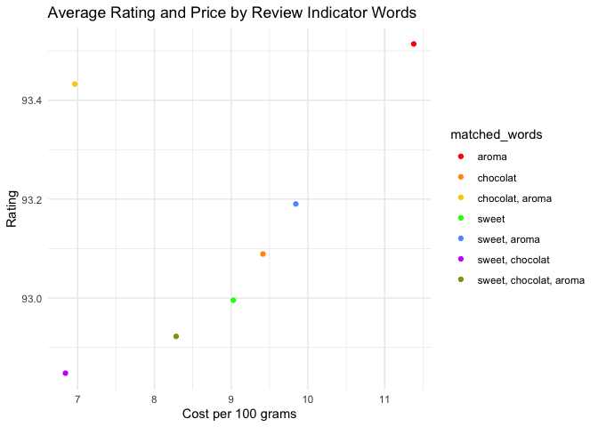

### Boxplot by Country and Roast Level

The goal is to trim the most expensive coffee products (this is informed
by the subsequent analysis). Boxplot shows the outliers in red. The
boxplot also illustrates that Taiwan and the US are the have the most
roasters.

``` r
d <- plot_cost_boxplot(data = coffee_indicators)
d
```

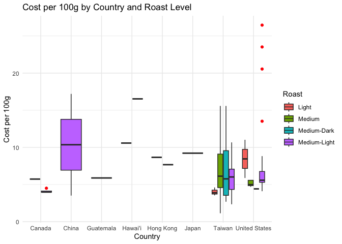

### Price Distribution

The distribution in price aids in determining where a hard cap on the
price should be. At USD8 per 100 grams, there is a fall in the number of
coffee products sold at this price, and provides a reasonable cap.

``` r
d <- plot_cost_distribution(data = coffee_indicators, cutoff = 8)
d
```

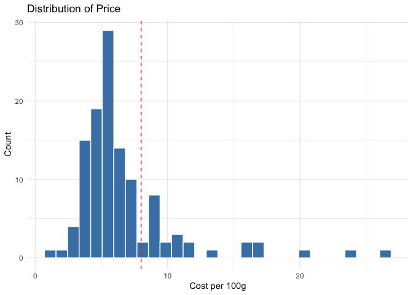

### Tile Plot

I have 4 variables that I now want to visualise 4 variables: roaster,
roast, cost, and rating.The tile graph will have rating, roaster, and
roast. I start with a new function that filters to the observations that
have aroma and chocolate indicator words in their reviews. This then
gets passed to a ggplot to make a tile graph. I need to calculate a
midpoint for the graph, so I do that before the tile plot code. I see
that I have to pull the midpoint otherwise it is a dataframe and there
are issues later on. I then just do the tile plot code like I practised.
I’m sure I can improve the functionality to make it more generic, but
this will do for now.

There are still way too many roasters. I should go back and use price
distributions to decide on a cutoff price.

I have decided on USD8 as the cutoff price and now I can use the tile
graph. It is still very cramped, so I’m going to adjust the text
settings and see if that looks good. There are still too many roasters.
I am only going to look at roasters that have more than one roast level,
so that the supplier offers a diversified range of coffee. I will just
group and ungroup to filter this in the function code.

This plot depicts the average ratings by roaster and roast level once
the coffee products that have a cost larger than USD8 and roasters that
only supply one remaining product have been filtered out. The reasoning
is that a distributor can provide a diversified selection of products.

``` r
f <- plot_choc_aroma_tile(data = coffee_indicators)
f
```

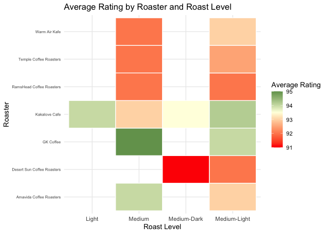

### Prices and Ratings for Roasters

The plot below displays the price-ratings relationship for narrowd-down
roasters. Kakalove Cafe seems to be a promising supplier, with most of
its product prices falling the lowest, and receiving the highest some of
the highest ratings. They also produce a variety of products.

``` r
f <- plot_choc_aroma_scatter(data = coffee_indicators)
f
```

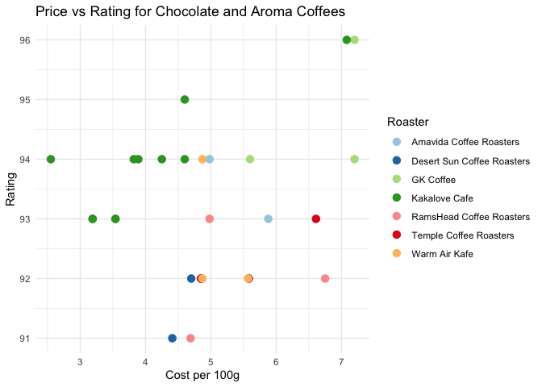

# Question 2:

``` r
# set up
knitr::opts_chunk$set(echo = FALSE, message = FALSE, warning = FALSE, fig.width = 6, fig.height = 5, fig.pos="H", fig.pos = 'H')

if(!require ( "pacman" , quietly = TRUE ) ) {
   install.packages("pacman")
   library(pacman)
   }

pacman::p_load(purrr, lubridate, tidymodels, ggridges, ggthemes, readxl, tidyverse, lubridate, zoo, pwt10,janitor, ggsci, haven)

list.files('25424971Question2/code/', full.names = T, recursive = T) %>% as.list() %>% walk(~source(.))


# load data
baby_names <- read_rds("25424971Question2/data/US_Baby_names/Baby_Names_By_US_State.rds") %>% 
    clean_names
top_100 <- read_rds("25424971Question2/data/US_Baby_names/charts.rds") %>% 
    clean_names
hbo_titles <- read_rds("25424971Question2/data/US_Baby_names/HBO_titles.rds") %>% 
    clean_names
hbo_credits <- read_rds("25424971Question2/data/US_Baby_names/HBO_credits.rds") %>% 
    clean_names
```

## Introduction

This report explores the persistence in baby name trends, as well as the
potential influence of popular culture on these trends.

### Spearman Rank Correlation

I like the idea of state-level data (especially New York), but for this
process, I will aggregate to a national level through the national
ranked function. I will get the top 25 most popular for girls and boys.
I will look at t, t+1, t+2, and t+3.

After I aggregate, I use the rank function, but this has assigned the
largest rank to the most popular name (need the opposite). To get to the
top 25, I just filter rank to be smaller or equal to 25 (shamefully,
took me a while to figure out).

To compute the Spearman correlation, I define base year and future year
objects in the function and then combine them to calculate the
correlation between the rankings of these years using the Spearman
method. The spearman results function expands over all the years (until
2011, as 3 future periods from then is 2014) and 1 to 3 lags are chosen,
as specified in the instructions. The variable correlation is now all
the spearman correlations across the years, genders, and lag lengths.
For the plot, new variables are created that are used as labels. Have to
make the lag variable a factor in order to apply my favourite palette. I
use the facet wrap so that I can view what is happening to girls’ and
boys’ names separately.

The time-series representations below depict the rank correlations of
baby names in the US from 1910-2014. It seems that boy names are more
persistent than girls names. It does appear that after the 1990’s, names
become less persistent, with the correlations becoming smaller. The
persistence in name trends has fallen for both girl and boy names over
time, however, trends seem to persistent longer still for boy names.

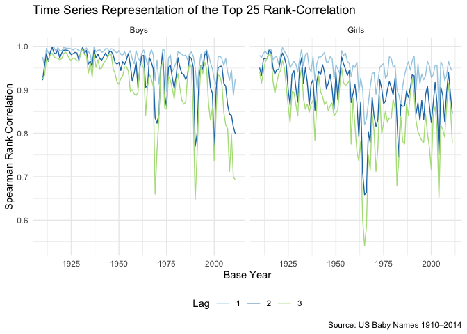

### Surges in Names

I want to make a function that spits out the names that have surged in
popularity over the course of a year. I create the variables to
calculate the year-on-year change in the number of children with each
name. I need to determine what percentage would classify as a surge.
After toggling it, I have chosen a threshold of 5000% for reporting. I
choose to look into “Mallory”. The function to create the graph is
simple, but I want to spruce it up a bit. I add a line to show when
“Family Ties” premiered.

Only 24% of the names have experienced a year-on-year surge greater than
5000% between 1910-2014 are boy names. The plot below inspects the
popularity of the name “Mallory” over time. “Mallory” spiked in 1983
following the 1982 premiere of “Family Ties” that included the
character, Mallory Keaton. It’s popularity dulled over the years,
illustrating the influence of popular culture on baby names.

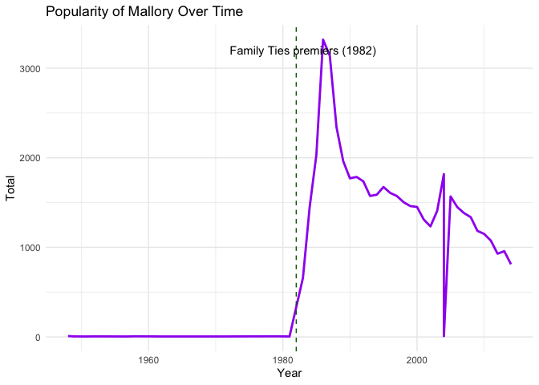

### Name Trends: Jude

Inspired by the Beatles documentary, “Get Back”, I want to look into
“Jude”. It looks like it gained more popularity in the 2000s. When I
think of the name, I think of Jude Law. I’ll see if he is credited and
when his breakout roles were (The Talented Mr Ripley was released in
1999).

According to the Billbord Hot 100, The Beatles’s hit song, “Hey Jude”,
was charting for 19 weeks between 1968 and 1969. Further, the credits
for popular films reveal that Jude Law stardom may also drive interest
in this gender neutral name. These two case studies depict the impact of
the media in naming conventions

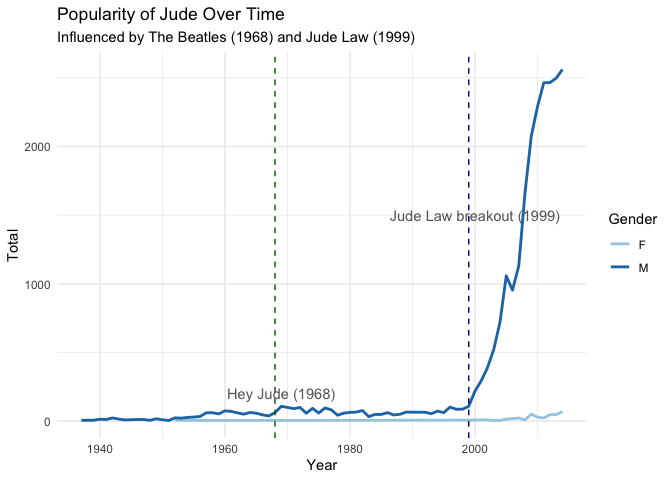

## Conclusion

Baby name trends are increasingly less persistent. This means that toy
names must quickly adapt, especially those marketed towards girls. To
stay on top of the trends, popular media must be studied. Through
analysing song charts and IMDb ratings, the company can stay inline with
the curve.
